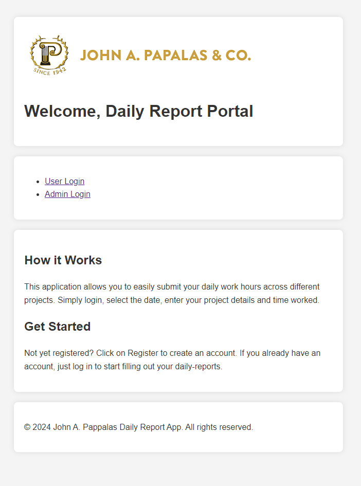

# Daily Report App

## Overview
The Daily Report App is a web application designed to manage and generate daily activity reports. Admins can log in to access reports, download them in PDF or Excel formats, and manage users.

## Features
- Admin login and logout
- Fetch and display daily reports by date
- Download daily reports as PDF or Excel files
- Select users for specific date reports
- Forgot password function - email will be sent to the email provided with a reset link
## Screenshots
### Main Page

### Admin Portal

### Daily Reports

## Requirements
- Node.js
- MySQL database
- Heroku account (for deployment)
- Office 365 email account 

## Installation
- npm install

### Clone the Repository
git clone https://github.com/FisherK19/JAP-Daily-Report
cd JAP-Daily-Report

### Set Up MySQL Database
1. Create a MySQL database.
2. Import the schema.sql file to set up the necessary tables.
3. Configure the database connection in the .env file.

### Configure Environment Variables
- PORT=3000
- DB_HOST=localhost
- DB_USER=your_db_user
- DB_PASSWORD=your_db_password
- DB_NAME=jap_timesheet
- EMAIL_ADDRESS=your_office365_email
- EMAIL_PASSWORD=your_office365_email_password

### Usage
npm start

### Access the Application
Open your web browser and navigate to http://localhost:3000.

### Admin Portal
1. Log in using your admin credentials.
2. Select a date to fetch users and their reports.
3. Download reports as PDF or Excel files.
4. Receive email with reset link for forgot password.

### Contributing
1. Fork the repository.
2. Create a new branch (git checkout -b feature-branch).
3. Make your changes and commit them (git commit -m 'Add some feature').
4. Push to the branch (git push origin feature-branch).
5. Open a pull request.

### License
This project is licensed under the MIT License. See the LICENSE file for more information.

This `README.md` provides comprehensive instructions for setting up, configuring, and using the application. It also includes sections for troubleshooting and contributing to the project.
